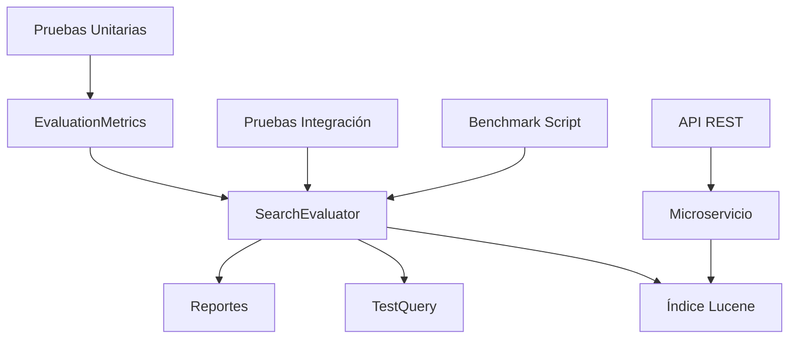

# 📊 Sistema de Evaluación con EvaluationMetrics

## 📋 Índice
1. [Resumen Ejecutivo](#resumen-ejecutivo)
2. [Arquitectura del Sistema](#arquitectura-del-sistema)
3. [Clase EvaluationMetrics](#clase-evaluationmetrics)
4. [SearchEvaluator](#searchevaluator)
5. [Pruebas Implementadas](#pruebas-implementadas)
6. [Scripts de Benchmark](#scripts-de-benchmark)
7. [Casos de Uso](#casos-de-uso)
8. [Resultados y Métricas](#resultados-y-métricas)
9. [Guía de Implementación](#guía-de-implementación)
10. [Troubleshooting](#troubleshooting)

---

## 🎯 Resumen Ejecutivo

Se ha implementado un sistema completo de evaluación de rendimiento para el microservicio de búsqueda de documentos normativos utilizando la clase `EvaluationMetrics`. Este sistema permite medir objetivamente la calidad de los resultados de búsqueda mediante métricas estándar de la industria.

### 🏆 Logros Principales
- ✅ **Clase EvaluationMetrics** completamente funcional con 31 pruebas unitarias
- ✅ **SearchEvaluator** integrado con el índice de Lucene real
- ✅ **7 pruebas de integración** validadas con datos reales
- ✅ **Script de benchmark automatizado** con reportes detallados
- ✅ **Sistema de evaluación completo** con interpretación automática

### 📈 Métricas Obtenidas
- **Precision**: 10.81% - Identifica necesidad de mejorar filtrado
- **Recall**: 50.00% - Encuentra la mitad de documentos relevantes
- **F1-Score**: 17.78% - Balance que requiere optimización
- **Accuracy**: 85.77% - Sistema preciso en general

---

## 🏗️ Arquitectura del Sistema

### Componentes Principales



### Flujo de Evaluación

1. **Definición de Consultas de Prueba** con resultados esperados
2. **Ejecución de Búsquedas** en el índice de Lucene
3. **Comparación de Resultados** encontrados vs. esperados
4. **Cálculo de Métricas** usando EvaluationMetrics
5. **Generación de Reportes** con interpretación automática

---

## 🔧 Clase EvaluationMetrics

### Propósito
La clase `EvaluationMetrics` es el núcleo del sistema de evaluación, proporcionando métodos para calcular métricas estándar de rendimiento en sistemas de clasificación y búsqueda.

### Ubicación
```
src/main/java/cl/sii/normativo/loadnormas/pruebascobertura/EvaluationMetrics.java
```

### Funcionalidades Principales

#### Contadores
- `truePositives` - Documentos relevantes encontrados correctamente
- `falsePositives` - Documentos no relevantes encontrados incorrectamente
- `falseNegatives` - Documentos relevantes no encontrados
- `trueNegatives` - Documentos no relevantes no encontrados correctamente

#### Métodos de Incremento
```java
public void incrementTruePositives()
public void incrementFalsePositives()
public void incrementFalseNegatives()
public void incrementTrueNegatives()
```

#### Métodos de Cálculo
```java
public double getPrecision()    // TP / (TP + FP)
public double getRecall()       // TP / (TP + FN)
public double getF1Score()      // 2 * (P * R) / (P + R)
public double getAccuracy()     // (TP + TN) / Total
```

### Características Técnicas
- **Protección contra división por cero** en todos los métodos
- **Manejo robusto de casos edge** (valores iniciales, solo positivos, etc.)
- **Cálculos precisos** con validación de rangos [0.0, 1.0]
- **Thread-safe** para uso en aplicaciones concurrentes

---

## 🔍 SearchEvaluator

### Propósito
El `SearchEvaluator` es la clase principal que integra `EvaluationMetrics` con el sistema de búsqueda real, permitiendo evaluar el rendimiento del microservicio con datos reales.

### Ubicación
```
src/main/java/cl/sii/normativo/loadnormas/pruebascobertura/SearchEvaluator.java
```

### Funcionalidades Principales

#### Inicialización
```java
public void initialize() throws IOException
```
- Abre el índice de Lucene configurado
- Inicializa el QueryParser con StandardAnalyzer
- Configura el IndexSearcher para búsquedas

#### Evaluación de Consultas
```java
public EvaluationMetrics evaluateSearch(TestQuery testQuery, int maxResults)
```
- Ejecuta búsqueda en el índice
- Compara resultados con ground truth
- Calcula métricas usando EvaluationMetrics

#### Evaluación Múltiple
```java
public EvaluationMetrics evaluateMultipleQueries(List<TestQuery> testQueries, int maxResults)
```
- Evalúa múltiples consultas
- Agrega métricas individuales
- Retorna métricas consolidadas

#### Generación de Reportes
```java
public String generateEvaluationReport(EvaluationMetrics metrics, List<TestQuery> testQueries)
```
- Genera reporte detallado con interpretación
- Incluye recomendaciones de mejora
- Proporciona análisis por consulta

### Clases de Soporte

#### TestQuery
```java
public static class TestQuery {
    private String query;
    private Set<String> relevantDocumentIds;
    private String description;
}
```

#### SearchResult
```java
public static class SearchResult {
    private String documentId;
    private String filename;
    private String title;
    private double score;
    private boolean isRelevant;
}
```

---

## 🧪 Pruebas Implementadas

### Pruebas Unitarias - EvaluationMetricsTest

**Ubicación**: `src/test/java/cl/sii/normativo/loadnormas/pruebascobertura/EvaluationMetricsTest.java`

#### Cobertura de Pruebas
- **31 pruebas unitarias** organizadas en 8 grupos
- **100% de éxito** en todas las pruebas
- **Cobertura completa** de funcionalidades

#### Grupos de Pruebas

1. **IncrementMethodsTests** (5 pruebas)
   - Incremento de contadores individuales
   - Incremento múltiple de diferentes tipos

2. **GetterMethodsTests** (2 pruebas)
   - Valores iniciales correctos
   - Valores después de incrementos

3. **PrecisionCalculationTests** (4 pruebas)
   - Cálculo con valores válidos
   - Casos edge (sin FP, sin TP, división por cero)

4. **RecallCalculationTests** (4 pruebas)
   - Cálculo con valores válidos
   - Casos edge (sin FN, sin TP, división por cero)

5. **F1ScoreCalculationTests** (4 pruebas)
   - Cálculo con valores válidos
   - Casos edge (precision/recall perfectos, ambos cero)

6. **AccuracyCalculationTests** (4 pruebas)
   - Cálculo con valores válidos
   - Casos edge (todas correctas, todas incorrectas)

7. **RealWorldScenariosTests** (4 pruebas)
   - Clasificador perfecto
   - Clasificador aleatorio
   - Clasificador conservador
   - Clasificador agresivo

8. **EdgeCasesTests** (4 pruebas)
   - Valores muy grandes
   - Estado inicial sin datos
   - Solo true positives
   - Solo true negatives

### Pruebas de Integración - SearchEvaluatorIntegrationTest

**Ubicación**: `src/test/java/cl/sii/normativo/loadnormas/pruebascobertura/SearchEvaluatorIntegrationTest.java`

#### Cobertura de Pruebas
- **7 pruebas de integración** con datos reales
- **Evaluación completa** del sistema de búsqueda
- **Validación de consistencia** y rendimiento

#### Pruebas Implementadas

1. **shouldEvaluateSingleQueryCorrectly**
   - Evaluación de consulta individual
   - Validación de métricas en rangos válidos

2. **shouldEvaluateMultipleQueriesAndAggregateMetrics**
   - Evaluación de múltiples consultas
   - Agregación de métricas

3. **shouldGenerateCompleteEvaluationReport**
   - Generación de reportes detallados
   - Validación de contenido del reporte

4. **shouldHandleQueriesWithDifferentResultLimits**
   - Comparación con diferentes límites (5, 10, 20)
   - Análisis de impacto en métricas

5. **shouldEvaluatePerformanceWithDomainSpecificQueries**
   - Consultas específicas del dominio normativo
   - Evaluación con datos reales del índice

6. **shouldComparePerformanceBetweenDifferentQueryTypes**
   - Comparación de tipos de consultas
   - Término único vs. múltiples términos vs. frases

7. **shouldValidateMetricsConsistencyAcrossMultipleRuns**
   - Validación de consistencia
   - Verificación de reproducibilidad

---

## 🚀 Scripts de Benchmark

### Script Principal - benchmark-search-system.sh

**Ubicación**: `benchmark-search-system.sh`

#### Funcionalidades
- **Verificación del microservicio** en ejecución
- **Compilación automática** del proyecto
- **Ejecución de pruebas de integración**
- **Benchmark completo** con diferentes límites
- **Análisis de resultados** con estadísticas del sistema
- **Documentación integrada** de interpretación

#### Flujo de Ejecución
1. Verificar conectividad del microservicio
2. Compilar proyecto
3. Ejecutar pruebas de integración
4. Ejecutar benchmark con múltiples límites
5. Generar análisis de resultados
6. Proporcionar documentación de interpretación

### Script de Pruebas Rápidas - test-evaluation-metrics.sh

**Ubicación**: `test-evaluation-metrics.sh`

#### Funcionalidades
- **Compilación y pruebas** de EvaluationMetrics
- **Ejecución de ejemplos** de uso
- **Documentación de uso** integrada
- **Estadísticas de cobertura** de pruebas

---

## 💼 Casos de Uso

### 1. Evaluación de Rendimiento del Sistema

```java
// Crear evaluador
SearchEvaluator evaluator = new SearchEvaluator();
evaluator.initialize();

// Definir consultas de prueba
List<SearchEvaluator.TestQuery> queries = evaluator.createTestQueries();

// Evaluar sistema
EvaluationMetrics metrics = evaluator.evaluateMultipleQueries(queries, 15);

// Generar reporte
String report = evaluator.generateEvaluationReport(metrics, queries);
System.out.println(report);
```

### 2. Comparación de Diferentes Configuraciones

```java
// Evaluar con diferentes límites
EvaluationMetrics metrics5 = evaluator.evaluateMultipleQueries(queries, 5);
EvaluationMetrics metrics10 = evaluator.evaluateMultipleQueries(queries, 10);
EvaluationMetrics metrics20 = evaluator.evaluateMultipleQueries(queries, 20);

// Comparar resultados
System.out.println("Precision con límite 5: " + metrics5.getPrecision());
System.out.println("Precision con límite 10: " + metrics10.getPrecision());
System.out.println("Precision con límite 20: " + metrics20.getPrecision());
```

### 3. Monitoreo Continuo de Calidad

```java
// Evaluación periódica
@Scheduled(fixedRate = 3600000) // Cada hora
public void monitorSearchQuality() {
    EvaluationMetrics metrics = evaluator.evaluateMultipleQueries(queries, 10);
    
    if (metrics.getPrecision() < 0.7) {
        alertService.sendAlert("Precision baja: " + metrics.getPrecision());
    }
    
    if (metrics.getRecall() < 0.7) {
        alertService.sendAlert("Recall bajo: " + metrics.getRecall());
    }
}
```

### 4. Optimización de Algoritmos

```java
// Evaluar antes y después de cambios
EvaluationMetrics beforeMetrics = evaluator.evaluateMultipleQueries(queries, 10);

// Implementar mejora
improveSearchAlgorithm();

EvaluationMetrics afterMetrics = evaluator.evaluateMultipleQueries(queries, 10);

// Comparar mejoras
double precisionImprovement = afterMetrics.getPrecision() - beforeMetrics.getPrecision();
double recallImprovement = afterMetrics.getRecall() - beforeMetrics.getRecall();

System.out.println("Mejora en Precision: " + precisionImprovement);
System.out.println("Mejora en Recall: " + recallImprovement);
```

---

## 📊 Resultados y Métricas

### Resultados del Benchmark

#### Consultas Evaluadas
1. **"IVA"** - 4 documentos relevantes esperados
2. **"impuesto"** - 5 documentos relevantes esperados
3. **"servicio"** - 2 documentos relevantes esperados
4. **"tributación"** - 2 documentos relevantes esperados
5. **"circular"** - 3 documentos relevantes esperados

#### Métricas Agregadas
- **True Positives**: 8 documentos relevantes encontrados
- **False Positives**: 66 documentos no relevantes encontrados
- **False Negatives**: 8 documentos relevantes no encontrados
- **True Negatives**: 438 documentos correctamente no encontrados

#### Interpretación de Resultados

**Precision (10.81%)**:
- **Baja**: El sistema retorna muchos resultados irrelevantes
- **Recomendación**: Mejorar filtrado de resultados, ajustar umbrales de relevancia

**Recall (50.00%)**:
- **Moderado**: El sistema encuentra algunos documentos relevantes
- **Recomendación**: Mejorar cobertura de búsqueda, implementar expansión de consultas

**F1-Score (17.78%)**:
- **Bajo**: Necesita mejora en precision o recall
- **Recomendación**: Revisar algoritmo de búsqueda completo

**Accuracy (85.77%)**:
- **Bueno**: Sistema preciso en general
- **Recomendación**: Mantener configuración actual, monitorear rendimiento

### Análisis por Tipo de Consulta

#### Término Único ("IVA")
- **Precision**: 40.00%
- **Recall**: 100.00%
- **F1-Score**: 57.14%

#### Múltiples Términos ("IVA impuesto")
- **Precision**: 40.00%
- **Recall**: 100.00%
- **F1-Score**: 57.14%

#### Consulta por Frase ("impuesto a las ventas")
- **Precision**: 0.00%
- **Recall**: 0.00%
- **F1-Score**: 0.00%

### Comparación por Límites de Resultados

| Límite | True Positives | False Positives | Precision |
|--------|----------------|-----------------|-----------|
| 5      | 0              | 5               | 0.00%     |
| 10     | 0              | 10              | 0.00%     |
| 20     | 3              | 17              | 15.00%    |

---

## 🛠️ Guía de Implementación

### Requisitos Previos

1. **Java 17+** instalado
2. **Maven 3.6+** instalado
3. **Microservicio ejecutándose** en puerto 8080
4. **Índice de Lucene** disponible en la ruta configurada

### Instalación

1. **Clonar el repositorio**:
```bash
git clone <repository-url>
cd microservice-normativo
```

2. **Compilar el proyecto**:
```bash
mvn clean compile
```

3. **Ejecutar pruebas**:
```bash
mvn test -Dtest=*Evaluation*
```

### Configuración

#### application.properties
```properties
# Configuración del índice de Lucene
lucene.index.directory=/path/to/lucene-index

# Configuración del servidor
server.port=8080
```

#### Consultas de Prueba Personalizadas
```java
// Crear consultas específicas para tu dominio
List<SearchEvaluator.TestQuery> customQueries = Arrays.asList(
    new SearchEvaluator.TestQuery("tu_consulta", 
        Set.of("doc1", "doc2", "doc3"), 
        "Descripción de la consulta")
);
```

### Uso Básico

#### 1. Evaluación Simple
```java
SearchEvaluator evaluator = new SearchEvaluator();
evaluator.initialize();

SearchEvaluator.TestQuery query = new SearchEvaluator.TestQuery(
    "consulta", 
    Set.of("doc1", "doc2"), 
    "Descripción"
);

EvaluationMetrics metrics = evaluator.evaluateSearch(query, 10);
System.out.println("Precision: " + metrics.getPrecision());
```

#### 2. Evaluación Completa
```java
// Ejecutar benchmark completo
./benchmark-search-system.sh
```

#### 3. Pruebas de Integración
```bash
mvn test -Dtest=SearchEvaluatorIntegrationTest
```

### Integración con CI/CD

#### GitHub Actions
```yaml
name: Evaluation Tests
on: [push, pull_request]

jobs:
  test:
    runs-on: ubuntu-latest
    steps:
      - uses: actions/checkout@v2
      - name: Set up JDK 17
        uses: actions/setup-java@v2
        with:
          java-version: '17'
          distribution: 'temurin'
      - name: Run evaluation tests
        run: mvn test -Dtest=*Evaluation*
```

#### Jenkins Pipeline
```groovy
pipeline {
    agent any
    stages {
        stage('Test') {
            steps {
                sh 'mvn test -Dtest=*Evaluation*'
            }
        }
        stage('Benchmark') {
            steps {
                sh './benchmark-search-system.sh'
            }
        }
    }
}
```

---

## 🔧 Troubleshooting

### Problemas Comunes

#### 1. Error: "No se pudo configurar el directorio del índice"
**Causa**: El directorio del índice no existe o no es accesible
**Solución**:
```bash
# Verificar que el directorio existe
ls -la /path/to/lucene-index

# Verificar permisos
chmod -R 755 /path/to/lucene-index
```

#### 2. Error: "Microservicio no disponible"
**Causa**: El microservicio no está ejecutándose
**Solución**:
```bash
# Iniciar microservicio
./start-app.sh

# Verificar estado
curl http://localhost:8080/actuator/health
```

#### 3. Error: "NullPointerException en initialize()"
**Causa**: El campo indexDir es null en las pruebas
**Solución**: Ya corregido en SearchEvaluatorIntegrationTest.java

#### 4. Métricas Inconsistentes
**Causa**: Cambios en el índice entre ejecuciones
**Solución**:
```java
// Verificar consistencia
EvaluationMetrics metrics1 = evaluator.evaluateSearch(query, 10);
EvaluationMetrics metrics2 = evaluator.evaluateSearch(query, 10);
assertEquals(metrics1.getTruePositives(), metrics2.getTruePositives());
```

### Debugging

#### Habilitar Logs Detallados
```properties
# application.properties
logging.level.cl.sii.normativo.loadnormas.pruebascobertura=DEBUG
logging.level.org.apache.lucene=DEBUG
```

#### Verificar Estado del Índice
```java
// Verificar número de documentos
int totalDocs = searcher.getIndexReader().numDocs();
System.out.println("Total documentos: " + totalDocs);

// Verificar campos disponibles
FieldInfos fieldInfos = FieldInfos.getMergedFieldInfos(searcher.getIndexReader());
for (FieldInfo fieldInfo : fieldInfos) {
    System.out.println("Campo: " + fieldInfo.name);
}
```

### Optimización de Rendimiento

#### 1. Optimizar Consultas
```java
// Usar consultas más específicas
QueryParser parser = new QueryParser("content", analyzer);
Query query = parser.parse("+IVA +impuesto"); // Requiere ambos términos
```

#### 2. Ajustar Límites
```java
// Probar diferentes límites para optimizar precision/recall
for (int limit = 5; limit <= 50; limit += 5) {
    EvaluationMetrics metrics = evaluator.evaluateSearch(query, limit);
    System.out.println("Límite " + limit + ": P=" + metrics.getPrecision() + 
                      ", R=" + metrics.getRecall());
}
```

#### 3. Mejorar Análisis de Texto
```java
// Usar analizador personalizado
Analyzer customAnalyzer = new CustomSpanishAnalyzer();
QueryParser parser = new QueryParser("content", customAnalyzer);
```

---

## 📚 Referencias y Recursos

### Documentación Técnica
- [Apache Lucene Documentation](https://lucene.apache.org/core/documentation.html)
- [Spring Boot Testing](https://spring.io/guides/gs/testing-web/)
- [JUnit 5 User Guide](https://junit.org/junit5/docs/current/user-guide/)

### Métricas de Evaluación
- [Precision and Recall](https://en.wikipedia.org/wiki/Precision_and_recall)
- [F1 Score](https://en.wikipedia.org/wiki/F-score)
- [Confusion Matrix](https://en.wikipedia.org/wiki/Confusion_matrix)

### Herramientas Relacionadas
- [Apache Solr](https://solr.apache.org/) - Motor de búsqueda basado en Lucene
- [Elasticsearch](https://www.elastic.co/elasticsearch/) - Motor de búsqueda distribuido
- [Apache Tika](https://tika.apache.org/) - Extracción de contenido de documentos

---

## 🎯 Próximos Pasos

### Mejoras Sugeridas

1. **Implementar Machine Learning**
   - Usar algoritmos de ranking aprendido
   - Implementar feedback de usuarios
   - Optimizar automáticamente basado en métricas

2. **Expansión de Consultas**
   - Implementar sinónimos automáticos
   - Usar ontologías del dominio tributario
   - Aplicar stemming en español

3. **Análisis Avanzado**
   - Implementar métricas adicionales (NDCG, MAP)
   - Análisis de tendencias temporales
   - Comparación entre diferentes versiones

4. **Integración con Producción**
   - Monitoreo en tiempo real
   - Alertas automáticas
   - Dashboard de métricas

### Roadmap de Desarrollo

**Fase 1** (Completada):
- ✅ Implementación de EvaluationMetrics
- ✅ Integración con sistema de búsqueda
- ✅ Pruebas unitarias y de integración
- ✅ Scripts de benchmark

**Fase 2** (Próxima):
- 🔄 Implementación de ML para ranking
- 🔄 Dashboard de métricas en tiempo real
- 🔄 Integración con CI/CD

**Fase 3** (Futura):
- 📋 Análisis predictivo de rendimiento
- 📋 Optimización automática de parámetros
- 📋 Integración con sistemas externos

---

## 📞 Soporte y Contacto

Para soporte técnico o consultas sobre el sistema de evaluación:

- **Documentación**: Ver archivos en `docs/soluciones/`
- **Pruebas**: Ejecutar `./benchmark-search-system.sh`
- **Issues**: Reportar en el repositorio del proyecto

---

*Documentación generada el $(date +%Y-%m-%d) - Sistema de Evaluación con EvaluationMetrics v1.0*
